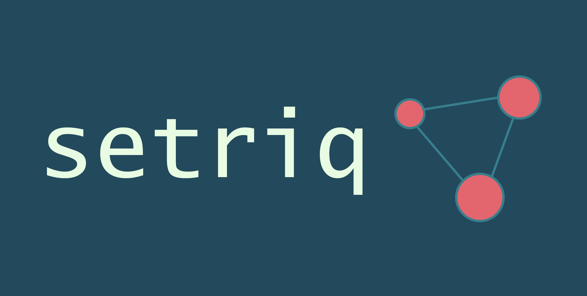

# setriq: pairwise sequence distances
[](https://circleci.com/gh/BenTenmann/setriq/tree/main)
[](https://codecov.io/gh/BenTenmann/setriq)
[](https://www.codefactor.io/repository/github/bentenmann/setriq)
[](https://opensource.org/licenses/MIT)



A `Python` package written in `C++` for computing pairwise distances between (immunoglobulin) sequences. 

## Install
This package is available on PyPI
```bash
pip install setriq
```

## Quickstart

`setriq` inherits from the `torch` philosophy of callable objects. Each `Metric` subclass is a callable upon 
initialisation, taking a list of objects (usually `str`) and returning a list of `float` values.

```python
import setriq
metric = setriq.CdrDist()

sequences = [
    'CASSLKPNTEAFF',
    'CASSAHIANYGYTF',
    'CASRGATETQYF'
]
distances = metric(sequences)
```

The returned list is flat and contains `N * (N - 1) / 2` elements, i.e. the lower (or upper) triangle of the distance 
matrix. To get the square form of the matrix, use `scipy.spatial.distance.squareform` on the returned distances.

## About

As the header suggests, `setriq` is a no-frills Python package for fast computation of pairwise sequence distances, with
a focus on immunoglobulins. It is a declarative framework and borrows many concepts from the popular `torch` library. It 
has been optimized for parallel compute on CPU architectures.

Available distance functions:
* CDRdist
* Levenshtein
* TCRdist
* Hamming
* Jaro
* Jaro-Winkler

These distance functions are available either through the object-based API (as seen above), which provides the CPU-based
parallelism, or the functional API in `setriq.single_dispatch`. Unlike the object-based API, the functional API does a
single comparison between two sequences for every call, i.e. it exposes the `C++` distance functions without the
parallelism wrapper. This can be useful for integration of `setriq` with other tools such as `PySpark`. For example:

```python
from pyspark.sql import SparkSession
from pyspark.sql.functions import udf
from pyspark.sql.types import DoubleType

from setriq import single_dispatch as sd

spark = SparkSession \
   .builder \
   .appName("setriq-spark") \
   .getOrCreate()

df = spark.createDataFrame([('CASSLKPNTEAFF',), ('CASSAHIANYGYTF',), ('CASRGATETQYF',)], ['sequence'])
df = df.withColumnRenamed('sequence', 'a').crossJoin(df.withColumnRenamed('sequence', 'b'))

lev_udf = udf(sd.levenshtein, returnType=DoubleType())  # single dispatch levenshtein distance
df = df.withColumn('distance', lev_udf('a', 'b'))
df.show()
```

It is important to note, that for `setriq.single_dispatch` the returned value is always a single float value.

## Requirements
A `Python` version of 3.7 or above is required, as well as a `C++` compiler equipped with OpenMP. The package has been 
tested on Linux and macOS. To get the required OpenMP resources, run:

On Linux:
```bash
sudo apt install libomp-dev && sudo apt show libomp-dev
```

On macOS:
```bash
brew install libomp llvm
```


## References
   1. Dash, P., Fiore-Gartland, A.J., Hertz, T., Wang, G.C., Sharma, S., Souquette, A., Crawford, J.C., Clemens, E.B.,
      Nguyen, T.H., Kedzierska, K. and La Gruta, N.L., 2017. Quantifiable predictive features define epitope-specific T cell 
      receptor repertoires. Nature, 547(7661), pp.89-93. (https://doi.org/10.1038/nature22383)
   2. Jaro, M.A., 1989. Advances in record-linkage methodology as applied to matching the 1985 census of Tampa,
      Florida. Journal of the American Statistical Association, 84(406), pp.414-420.
   3. Levenshtein, V.I., 1966, February. Binary codes capable of correcting deletions, insertions, and reversals. In
      Soviet physics doklady (Vol. 10, No. 8, pp. 707-710).
   4. python-Levenshtein (https://github.com/ztane/python-Levenshtein)
   5. Thakkar, N. and Bailey-Kellogg, C., 2019. Balancing sensitivity and specificity in distinguishing TCR groups by CDR
      sequence similarity. BMC bioinformatics, 20(1), pp.1-14. (https://doi.org/10.1186/s12859-019-2864-8)
   6. Van der Loo, M.P., 2014. The stringdist package for approximate string matching. R J., 6(1), p.111.
   7. Winkler, W.E., 1990. String comparator metrics and enhanced decision rules in the Fellegi-Sunter model of record
      linkage.
